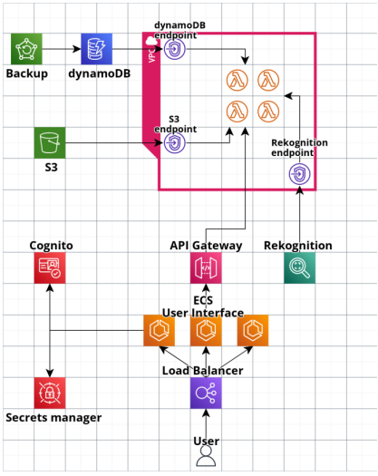

# AWS Project - Watermark App

AWS project for Cloud Computing. The application allows user to:
1. apply watermarks to images
2. add/remove images and watermarks from private accounts
3. view user history

## Application diagram



1. User connects to load balancer via HTTP protocol
2. Load balancer distributes incoming traffic over ECS containers (serving the UI), in order to
reduce latency and optimize resource utilization
3. User authenticates with Amazon Cognito. Cognito credentials, which allow adding user to
proper user pool, are gathered from AWS Secrets Manager.
4. User gains access to app functionality by connecting to API gateway. API Is supported by AWS
Lambda functions, which process the incoming requests.
5. S3 bucket is used to store images and watermarks uploaded by user.
6. DynamoDB tables grant persistence of data gathered from images and user actions. We use
AWS Backup for backing up our databases.
7. VPC contains endpoints for AWS Services such as S3, dynamoDB and Rekognition, along with
AWS Lambda cluster. The VPC provides secure environment for data exchange (as data is not
exposed to internet and is accessed via endpoints). 

## Project Structure

```
.
├── README.md
│
├── Dockerfile  <- docker image 
│
├── cloudformation-template.yaml <- cloudformation template
│
├── requirements.txt <- python requirements
│
├── cloud_functions <- aws lambda functions
│   ├── api_gateway
│   │   ├── display_user_history.py
│   │   ├── insert_watermark.py
│   │   ├── list_images.py
│   │   └── upload_image.py
│   │
│   ├── dynamoDB_S3_connectivity
│   │   ├── delete_image_data_and_update_dynamoDB.py
│   │   ├── send_image_data_to_dynamoDB.py
│   │   ├── test_event_delete.json
│   │   └── test_event_send.json
│   │
│   ├── test_images
│   │   └── ...
│   │
│   └── unit_tests_lambda_functions.py
│
│
├── resources
│   └── ...
│
├── tests   <- unit tests
│   └── test_add_watermark.py
│
└── user_interface <- source code for the streamlit app
    ├── images
    │   └── watermark-logo.png
    │
    ├── main_page.py <- entry script for deploying the app
    │
    └── pages
        ├── 1_upload_images.py
        ├── 2_list_images.py
        ├── 3_apply_watermark.py
        ├── 4_remove_watermark.py
        ├── 5_User_history.py
        │
        └── api_and_functions
            ├── add_remove_watermark.py
            ├── api_requests.py
            ├── get_secrets.py
            └── watermark_remover.py
```
